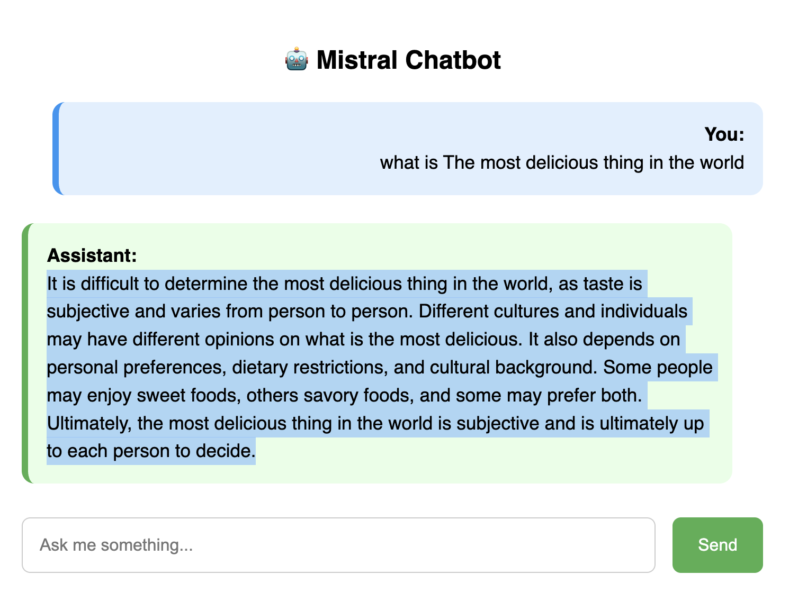

## chatbot

#### desc

This is a simple chatbot. After a question is given on the page, it will call the backend model to generate the answer and then give the user the answer. It is very simple and interesting. The model backend uses mixtral-7b. You are welcome to try it.

#### other

Added later

#### show

